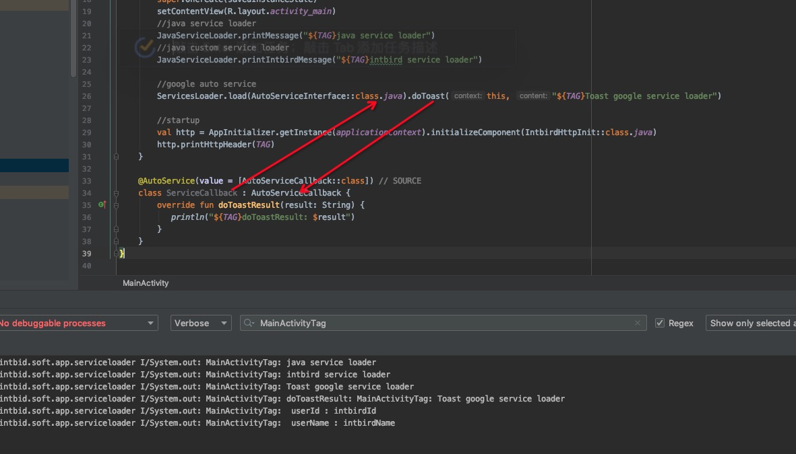

AutoService
========

This repo is a sample of java service loader

========

# implements

 ```
  //java service loader and custom path service loader
  intbird.soft.app.JavaServiceLoader

  // https://github.com/google/auto/tree/master/service
  'com.google.auto.service:auto-service-annotations:1.0-rc6'

  // https://proandroiddev.com/androidx-app-startup-698855342f80
  'androidx.startup:startup-runtime:1.0.0-beta01'

 ```


# Samples
```
include ':service-loader' // myself serviceloader
include ':services-android' // androidx startup demo
include ':services-google' // auto servcie demo
include ':services-java' // java service demo
```

## auto servcie & androidx startup 



--------
# intbird

myselt auto service loader
#### 1.add maven url in root project `build.gradle` file
```
allprojects {
    repositories {
        google()
        jcenter()
        maven { url "https://intbird.ml/maven/releases/" }
    }
}
```

#### 2.add classpath in root project `build.gradle` file ,
$lastVersion = 1.0.0 [click here to see more info](CHANGELOG.md)  

```
dependencies {
    implementation 'intbird.soft.lib:service-loader:1.0.0'
}
```